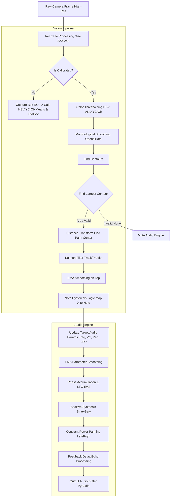

# VisionHarp V4 - Viva Study Guide

## 1. System Overview & Methodology
VisionHarp is a real-time, non-tactile virtual instrument. It processes webcam video using Computer Vision (OpenCV) to track the user's hand, maps spatial coordinates (X, Y, Depth) to musical parameters, and generates sound dynamically using a custom software synthesizer (PyAudio/NumPy).

**Key Methodology Shift (V3 to V4):**
Earlier versions used Gaussian Mixture Model (MOG2) for background subtraction. MOG2 constantly adapts its background model; if a user holds their hand still, MOG2 starts absorbing the hand into the background, causing the mask to "eat away" and flicker. V4 abandons MOG2 in favor of **static, calibrated skin-color detection** (HSV + YCrCb), ensuring rock-solid stability even for stationary notes.

---

## 2. Complete Workflow Diagram

---

## 3. Vision Processing Engine
### A. Skin Detection & Calibration (`calibrate`, `build_mask_small`)
*   **Why used:** To isolate the hand from the background reliably.
*   **Methodology:** Combines two color spaces: **HSV** (Hue, Saturation, Value) and **YCrCb** (Luma, Blue-Difference, Red-Difference).
*   **Logic & Math:**
    *   **Calibration:** Taking an ROI, we calculate the `mean` for HSV. We bound it as `[mean - 25, 30, 40]` to `[mean + 25, 255, 255]`. For YCrCb, we calculate both `mean` and `standard deviation (std)`. The range is dynamically set to `mean ± 2 * std`.
    *   **Masking:** We independently threshold both color spaces. The final mask is the **bitwise AND** of both (`mask = cv2.bitwise_and(mask, ycr_mask)`). This is highly robust because it requires a pixel to look like skin in *both* color models, heavily reducing false positives (e.g., a wall that triggers HSV but fails YCrCb).
*   **Morphology:** `cv2.morphologyEx(MORPH_OPEN)` removes small noise ("salt"), and `dilate` expands the core hand blob to fill tiny holes ("pepper").

### B. Finding the True Palm Center (`get_palm_center`)
*   **Why used:** A bounding box center or standard centroid fluctuates wildly when fingers open/close. We need a stable tracking origin.
*   **Methodology:** **Distance Transform** algorithm.
*   **Logic & Math:** `cv2.distanceTransform(mask, cv2.DIST_L2, 5)` loops over the binary mask and replaces every white pixel (hand) with its Euclidean distance (L2) to the nearest black pixel (background). By finding the `minMaxLoc` of this new image, we find the pixel furthest away from any edge — mathematically, the exact center of the thickest part of the hand (the palm).

### C. Advanced State Tracking (Kalman Filter + EMA)
*   **Why used:** To predict hand position if detection temporarily fails, and to smooth out micro-jitters from the webcam sensor.
*   **Methodology:** A 4-state Linear **Kalman Filter** cascaded into an **Exponential Moving Average (EMA)** filter.
*   **Logic & Math:**
    *   **Kalman:** The state is `[x, y, dx, dy]` (position and velocity).
        *   `Transition Matrix`: Maps how state updates predictably. `x_new = x_old + dx_old * dt`. Represented as a matrix with 1s on the diagonal and 1s at `(0,2)` and `(1,3)`.
        *   `Covariance Tuning`: Low `processNoise` ($0.01$) means we assume the hand moves according to smooth physics (velocity matters). High `measurementNoise` ($5.0$) means we tell the filter, "don't instantly trust the raw webcam pixels, they might be noisy".
    *   **EMA:** `smooth = smooth + (kalman_val - smooth) * alpha`. With `alpha = 0.35`, the new position is 35% the new Kalman coordinate and 65% the historical coordinate. This acts as a low-pass filter, creating a "buttery" feel.

### D. Note Index Hysteresis (`get_note_index`)
*   **Why used:** If a hand hovers exactly on the boundary line between Note C and Note D, sensor noise will cause the instrument to rapidly flutter back and forth between C and D.
*   **Methodology:** Hysteresis (often used in Schmitt Triggers in hardware). 
*   **Logic & Math:**
    *   Instead of switching notes the millisecond a threshold is crossed, we establish a "deadzone".
    *   If current center of column is $C_x$ and column width is $W$, standard switching happens at distance $> 0.5W$.
    *   Our logic: `if dist > col_w * 0.6`. We force the user to move **60%** into the adjacent column before we snap to the new note. This completely eliminates edge-boundary flickering.

### E. Selective Background Blur (`segment_fg`)
*   **Why used:** For UI aesthetics, blurring the background makes the UI and hand pop out. However, blurring a 1080p frame at 30+ FPS is extremely CPU-costly.
*   **Methodology:** **Frame caching & Temporal Subsampling.**
*   **Logic:** We only compute `cv2.blur` once every 8 frames (`bg_counter % 8 == 0`). For the other 7 frames, we reuse the cached blurred image and just overlay the *current* hand mask. This provides a 8x speedup on background processing without noticeable visual lag on the background (since backgrounds barely move).

---

## 4. Audio Processing Engine
### A. Parameter Smoothing (Anti-Clicking)
*   **Why used:** Changing frequency or volume instantly in an audio stream causes harsh mathematical discontinuities in the waveform, heard as clicking or popping.
*   **Math:** EMA is used on *every* audio target variable in the `callback`. E.g., `curr_vol += (target_vol - curr_vol) * 0.1`. Volume ramps up over ~20 milliseconds rather than jumping instantly.

### B. Waveform Synthesis & LFO
*   **Why used:** Generates the actual sound wave. A pure sine wave is boring; we want a richer synth tone with vibrato.
*   **Math:**
    *   **Phase Accumulation:** To play a frequency $f$, we increase the phase of our wave by $\Delta\theta = 2\pi(f/F_s)$ every sample ($F_s$ is sample rate, 44100). We keep cumulating this: `phases = self.phase + np.cumsum(pi)` (done via numpy vectorization for speed). We save the remainder `phases[-1] % 2pi` for the next buffer to ensure continuity.
    *   **LFO (Vibrato):** Low Frequency Oscillator modifies the base pitch dynamically. `mod_f = base_freq + np.sin(lfo_phase) * 8.0`. This varies the pitch up and down by 8Hz at the LFO rate (controlled by hand depth/radius).
    *   **Additive Synthesis:** `saw = sine + 0.5*np.sin(2*phases) + 0.25*np.sin(4*phases)`. By adding harmonic multiples (2x, 4x) at decreasing amplitudes, we mathematically approximate a richer "sawtooth" timbre using Fourier principles.

### C. Spatial Audio: Panning & Latency Delay
*   **Why used:** Creates a wide, immersive stereophonic soundscape (Ping-Pong Echo).
*   **Math:**
    *   **Constant Power Panning:** If we just linearly map volume (Left = $1-x$, Right = $x$), the center sounds quiet due to acoustic cancellation. We use trigonometric panning across a $90^\circ$ ($\pi/2$) arc.
        *   Left channel amplitude: $A_L = \cos(x \cdot \pi/2)$
        *   Right channel amplitude: $A_R = \sin(x \cdot \pi/2)$
        *   This ensures $A_L^2 + A_R^2 = 1$ (constant acoustic energy).
    *   **Delay/Echo Buffer:** We maintain circular NumPy arrays.
        *   Read old delayed signal: `dL = buff_L[iL]`
        *   Mix dry and wet: output `oL = dry + dL*0.4`
        *   Feedback into buffer: `buff_L[iL] = dry + dL*0.6` (creates the decaying repetitions).

---

## 5. Musical Logic (`_build_scale`)
*   **Why used:** To lock the instrument to musical scales rather than continuous, unmusical sliding pitches (like a Theremin).
*   **Math:** Uses Western **Equal Temperament Tuning**.
    *   The octave is divided into 12 semitones. Each semitone is separated by a frequency ratio of $2^{1/12} \approx 1.05946$.
    *   Base pitch: Evaluated against standard C. E.g., `C3 = 130.81 Hz`.
    *   Freq of any note = $F_{base} \times 2^{(semitone\_offset / 12.0)}$.
    *   The code pre-calculates dictionaries of semitone offsets (`[0,2,4,5,7,9,11]` for Major) and computes the exact $Hz$ values before play routing begins, saving CPU cycles during runtime.
